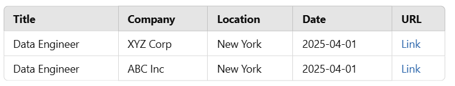

### Job Search Automation using Jooble API

### Overview

This project automates job searching using the Jooble API. It allows users to fetch job listings posted within the last 24 hours based on specified keywords and locations. The results are structured and saved in a CSV file.

# Features Explained

# Automated Job Searching: The script automates fetching job postings from Jooble instead of manually searching on platforms like LinkedIn.

Filtering Mechanism: It filters jobs based on title and location to provide relevant results.

# Output Formats:

Displays results in the console for quick viewing.

Saves results in a CSV file (jooble_results.csv) for further analysis.

Command Line Interface (CLI): Users can specify custom job titles and locations via command-line arguments.

Prerequisites

Python 3.x: Ensure Python is installed on your system.

Jooble API Key: The script requires an API key to fetch job postings. The obtained key is mbda6d887-e1c5-4a2d-8160-5a5a3d7bb83c.

Required Python Library:

requests (for API calls)

# Installation and Setup

Step 1: Clone the Repository

Run the following command in the terminal:
git clone <repository-url>
cd C:\Users\eriga\OneDrive\Desktop\job_search_poc
Step 2: Install Dependencies
pip install requests
Step 3: Configure API Key
Ensure the correct API key is placed in the script (search_jobs.py).
Running the Script

# Default Execution

To fetch Data Engineer jobs in New York:
python search_jobs.py
Custom Queries

You can modify job title and location dynamically using:
python search_jobs.py --keyword "Data Engineer" --location "New York"  

API Usage and Limitations Explained

API Query Mechanism: The script sends a request to the Jooble API with job title and location parameters.

Rate Limits: Jooble may impose restrictions on the number of API requests per hour.

Filtering Options: Jooble supports filtering jobs based on date posted, but advanced filtering might be limited.

Response Structure: The API returns job title, company name, location, posted date, and job URL.

# Code Implementation

import requests
import csv

API_URL = "https://jooble.org/api/ad755797-6f99-4d72-afd6-080f5e8a9e72"
payload = {
    "keywords": "data engineer",
    "location": "New York",
    "datePosted": "1"  # last 24 hours if supported
}

response = requests.post(API_URL, json=payload)
data = response.json()

with open('jooble_results.csv', 'w', newline='') as file:
    writer = csv.writer(file)
    writer.writerow(['Title', 'Company', 'Location', 'Date', 'URL'])
    for job in data.get('jobs', []):
        writer.writerow([
            job['title'],
            job['company'],
            job['location'],
            job['updated'],
            job['link']
        ])

Sample Output (jooble_results.csv)

# After execution, the script generates a CSV file with the following format:

